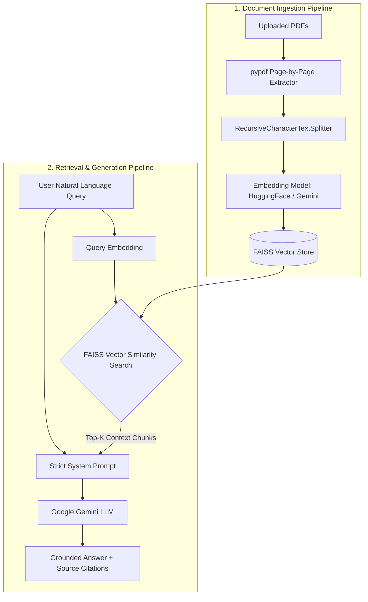

# Interactive PDF Reader – Retrieval-Augmented Generation (RAG) Application

A production-quality Streamlit web application that enables users to upload single or multiple PDF documents, ask complex natural language questions, and receive accurate, context-aware answers using Retrieval-Augmented Generation (RAG), FAISS, LangChain, and Google Gemini API.

---

## 📌 1. Project Overview

Modern Large Language Models (LLMs) like Google Gemini possess vast general knowledge but lack access to private, proprietary, or recently created documents. Uploading massive PDFs directly into an LLM context window is costly, slow, and prone to hallucinations or context dilution.

This application implements a complete **RAG (Retrieval-Augmented Generation)** architecture:
- PDF documents are processed, split into semantic chunks, and embedded into vector representations.
- A **FAISS** vector store provides lightning-fast similarity search over thousands of document pages.
- When a user asks a question, only the **Top-K most relevant chunks** are retrieved and injected into a strict system prompt provided to **Google Gemini**.
- Answers are guaranteed to be grounded strictly in the uploaded PDF content, complete with **source citations (file name, page number, distance score, and chunk snippet)**.

---

## 🏗️ 2. Architecture & Data Flow



### Detailed Runtime Step-by-Step Flow:
1. **Upload & Extract:** PDFs are uploaded via Streamlit. Text is parsed page-by-page preserving document metadata (`source`, `page`, `total_pages`).
2. **Recursive Chunking:** Text is split using `RecursiveCharacterTextSplitter` into overlapping windows (e.g., 1000 characters with 200 character overlap).
3. **Vector Embedding:** Text chunks are transformed into dense vector representations using either local `sentence-transformers/all-MiniLM-L6-v2` or Google `text-embedding-004`.
4. **FAISS Indexing:** Embeddings are indexed into an in-memory L2/Cosine FAISS vector store.
5. **Similarity Search:** The user query is embedded and compared against stored chunk vectors to retrieve the Top-K nearest neighbors.
6. **Prompt Assembly & LLM Generation:** Retrieved text snippets are injected into a constrained prompt instruction sent to Google Gemini, producing an exact response with source badges.

---

## 🛠️ 3. Tech Stack

- **Frontend & Framework:** Streamlit (`app.py`)
- **Orchestration:** LangChain LCEL (`langchain`, `langchain-core`, `langchain-community`)
- **Vector Storage & Search:** FAISS (`faiss-cpu`)
- **Embeddings:** HuggingFace `sentence-transformers` (Local CPU) or Google Generative AI Embeddings
- **Large Language Model:** Google Gemini (`gemini-1.5-flash`, `gemini-1.5-pro`, `gemini-2.0-flash`) via `langchain-google-genai`
- **PDF Parser:** `pypdf`
- **Environment Management:** `python-dotenv`

---

## 📂 4. Project Structure

```
pdf-rag-reader/
│
├── app.py                  # Main Streamlit web application & UI workflow
├── requirements.txt        # Python dependency specifications
├── .env                    # Environment variables file (API Keys)
├── .gitignore              # Git ignore configuration
├── README.md               # Project documentation & technical interview guide
│
├── src/
│   ├── __init__.py         # Package initialization
│   ├── pdf_processor.py    # PDF text extraction & text splitter logic
│   ├── embeddings.py       # HuggingFace & Gemini embedding model factory
│   ├── vector_store.py     # FAISS vector store creation & similarity search
│   ├── rag_chain.py        # LangChain LCEL prompt assembly & Gemini execution
│   └── utils.py            # API key loading, masking, & citation formatting
│
└── data/                   # Directory for storing sample PDFs
```

---

## 🚀 5. Installation & Setup

### Prerequisites
- Python 3.9 - 3.12 (or Python 3.14)
- Google Gemini API Key (Get a free key at [Google AI Studio](https://aistudio.google.com/))

### Step 1: Clone Repository & Create Virtual Environment
```bash
git clone https://github.com/your-username/pdf-rag-reader.git
cd pdf-rag-reader

# Create virtual environment
python -m venv venv

# Activate virtual environment
# On Windows:
venv\Scripts\activate
# On macOS/Linux:
source venv/bin/activate
```

### Step 2: Install Dependencies
```bash
pip install -r requirements.txt
```

### Step 3: Configure Environment Variables
Create a `.env` file in the project root:
```env
GOOGLE_API_KEY=your_actual_gemini_api_key_here
```

---

## 🏃 6. How to Run the Application

Start the Streamlit application:
```bash
streamlit run app.py
```

The app will open automatically in your browser at `http://localhost:8501`.

---

## 🧠 7. In-Depth Technical Concepts for Technical Interviews

### Why RAG instead of sending the full PDF directly to Gemini?
1. **Context Window Costs & Efficiency:** Passing a 200-page PDF (approx. 100,000 tokens) in every API request is expensive and slow. RAG sends only the top 3-5 relevant chunks (~1,500 tokens).
2. **Context Dilution ("Lost in the Middle"):** LLMs struggle to recall precise facts buried inside massive prompts. RAG isolates exact text paragraphs, raising retrieval accuracy.
3. **Hallucination Prevention:** Direct prompting allows the model to draw on pre-trained external knowledge. RAG restricts the model to strictly ground its answer on retrieved context.

### Why FAISS (Facebook AI Similarity Search)?
FAISS is an open-source library optimized for efficient vector similarity search and clustering of dense vectors. It operates directly in memory, uses C++ SIMD hardware acceleration, and supports both exact vector matching (Flat L2/Inner Product) and approximate nearest neighbor (ANN) indexing for high-scale document retrieval.

### Why are Embeddings Required?
Embeddings convert discrete text tokens into high-dimensional continuous vector spaces (e.g., 384 dimensions for `all-MiniLM-L6-v2` or 768 for Gemini). Text chunks with similar semantic meaning are mapped close together in geometric space, allowing vector distance calculation (Cosine or Euclidean distance) to match concepts even if exact keywords differ (e.g., matching "automobile" with "car").

### Why Chunk Size and Overlap Matter
- **Chunk Size:** Small chunks (e.g., 200 chars) preserve precise semantic focus but lack surrounding context. Large chunks (e.g., 3000 chars) include ample context but dilute semantic similarity signals. A chunk size of 800-1200 characters strikes an optimal balance.
- **Chunk Overlap:** Overlap (e.g., 150-200 chars) ensures key sentences spanning chunk boundaries are not truncated or split across vectors, preserving context across chunk transitions.

### How Semantic Search Works
1. Text chunks are passed through an embedding neural network model, producing dense numerical vectors.
2. The user query is converted into a vector using the **exact same** embedding model.
3. FAISS computes the mathematical distance (e.g., L2 distance or Cosine similarity) between the query vector and all chunk vectors.
4. The chunks with the smallest vector distance are returned as the Top-K results.

### How Hallucinations are Reduced
- **Strict System Prompting:** The prompt explicitly mandates: *"Answer ONLY based on the provided CONTEXT. If missing, reply: 'I couldn't find this information in the uploaded document.'"*
- **Low Temperature:** Temperature is set to low values (0.0 - 0.2) to minimize random output generation.
- **Explicit Source Verification:** The user UI displays the exact PDF page and text chunk used to construct the answer.

---

## 📊 8. Time & Space Complexity Analysis

| Operation | Time Complexity | Space Complexity | Explanation |
| :--- | :--- | :--- | :--- |
| **PDF Text Extraction** | $O(P \cdot T)$ | $O(P \cdot T)$ | $P$ = total pages, $T$ = average characters per page. Linear scan over pages. |
| **Text Chunking** | $O(N)$ | $O(N)$ | $N$ = total text length. Sliding window split. |
| **Embedding Generation** | $O(C \cdot M)$ | $O(C \cdot D)$ | $C$ = total chunks, $M$ = average tokens per chunk, $D$ = vector embedding dimensions. |
| **FAISS Vector Indexing** | $O(C \cdot D)$ | $O(C \cdot D)$ | In-memory matrix storage for $C$ vectors of dimension $D$. |
| **Similarity Search (Exact L2)** | $O(C \cdot D + K \log K)$ | $O(K)$ | Distance computed between query vector and $C$ chunk vectors, followed by top-K selection. |
| **Gemini Answer Generation** | $O(K \cdot M + R)$ | $O(R)$ | $K \cdot M$ = context prompt tokens, $R$ = output response tokens. |

---

## 🎯 9. 10 Technical Interview Questions & Answers

#### Q1: What is Retrieval-Augmented Generation (RAG) and why is it useful?
> **Answer:** RAG combines information retrieval with generative language models. It retrieves external context specific to a user query from a vector database and feeds it into the LLM's prompt. This allows LLMs to answer questions on private or domain-specific data without retraining or fine-tuning, while drastically reducing hallucinations.

#### Q2: How does `RecursiveCharacterTextSplitter` work?
> **Answer:** It splits text hierarchically using a list of separators (e.g., `["\n\n", "\n", ". ", " ", ""]`). It attempts to split on paragraph breaks first, falling back to sentences and words only when necessary to keep chunks below `chunk_size` while keeping related semantic sentences intact.

#### Q3: What is the difference between Keyword Search (BM25) and Semantic Vector Search?
> **Answer:** Keyword search (like BM25) matches exact vocabulary tokens. Semantic search converts text into dense vector embeddings, matching concepts based on high-dimensional mathematical proximity regardless of phrasing or synonyms.

#### Q4: Why is chunk overlap necessary?
> **Answer:** Without overlap, a critical sentence or fact located right at a chunk boundary might get cut in half. Overlapping chunks ensure that boundary context is preserved in both adjacent vectors.

#### Q5: How do you handle non-retrievable queries (when the answer is not in the document)?
> **Answer:** By engineering a strict system prompt instructing the model to evaluate the retrieved context and output a specific fallback string (e.g., *"I couldn't find this information in the uploaded document"*) if the context does not contain the answer.

#### Q6: What embedding model did you choose and why?
> **Answer:** We support local HuggingFace embeddings (`all-MiniLM-L6-v2`) which generate 384-dimensional vectors fast on CPU without API latency or quota limits, as well as Google `text-embedding-004` for higher multi-lingual accuracy.

#### Q7: What happens if a PDF contains scanned images without text?
> **Answer:** Standard PDF text extractors (like `pypdf`) extract zero characters from pure raster images. The application handles this gracefully by detecting empty character counts, alerting the user, and recommending an Optical Character Recognition (OCR) pipeline (e.g., Tesseract or pdf2image).

#### Q8: How can you scale this application for millions of documents?
> **Answer:** Upgrade from in-memory FAISS flat index to an ANN index (e.g., FAISS `IndexIVFFlat` or `IndexHNSW`), or deploy a dedicated cloud vector database like Pinecone, Milvus, or Qdrant with asynchronous background indexing workers.

#### Q9: Why is temperature set to 0.2?
> **Answer:** Temperature controls output randomness. A low temperature (0.0 - 0.2) forces greedy/deterministic token sampling, which is ideal for factual QA applications where precision is paramount.

#### Q10: How do you evaluate RAG answer quality?
> **Answer:** Using RAG triaging metrics such as **Faithfulness** (is the answer grounded in context?), **Answer Relevance** (did it answer the query?), and **Context Precision** (were the retrieved chunks relevant?). Tools like Ragas or TruLens automate these evaluations.

---

## 🔮 10. Future Improvements
- [ ] Add Optical Character Recognition (OCR) support for scanned PDF documents.
- [ ] Implement Hybrid Search (combining BM25 keyword search with FAISS dense vector search).
- [ ] Add support for DOCX, TXT, and CSV file formats.
- [ ] Integrate persistent vector database storage (e.g., ChromaDB / Pinecone).
- [ ] Add PDF document visualizer with highlighted source bounding boxes.

---
*Developed with Python, Streamlit, LangChain, FAISS, and Google Gemini API.*
